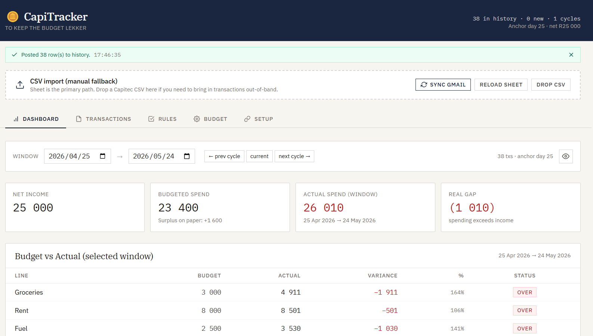
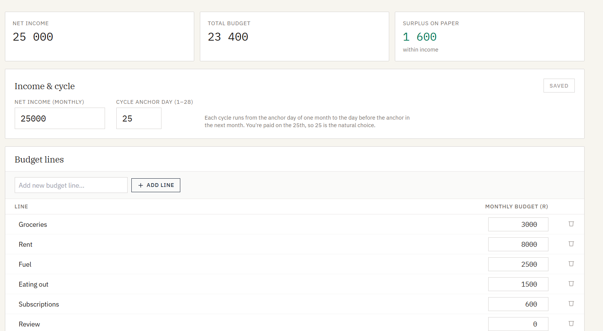
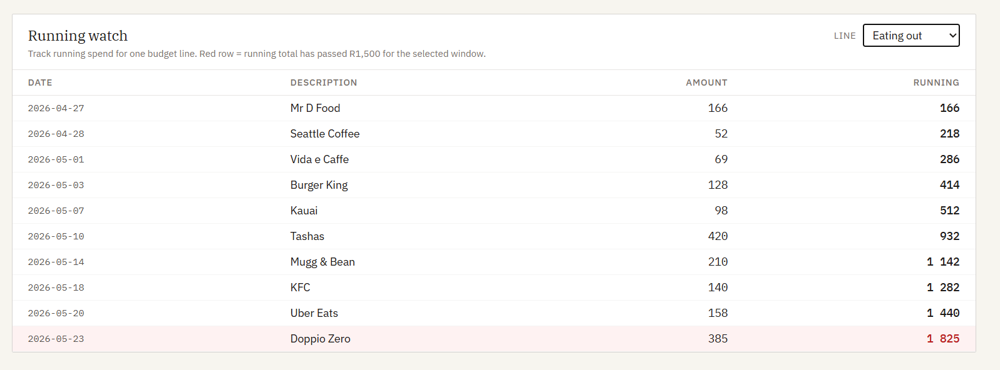
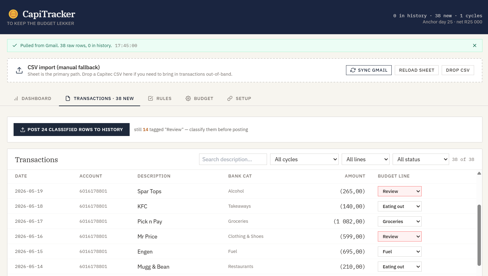
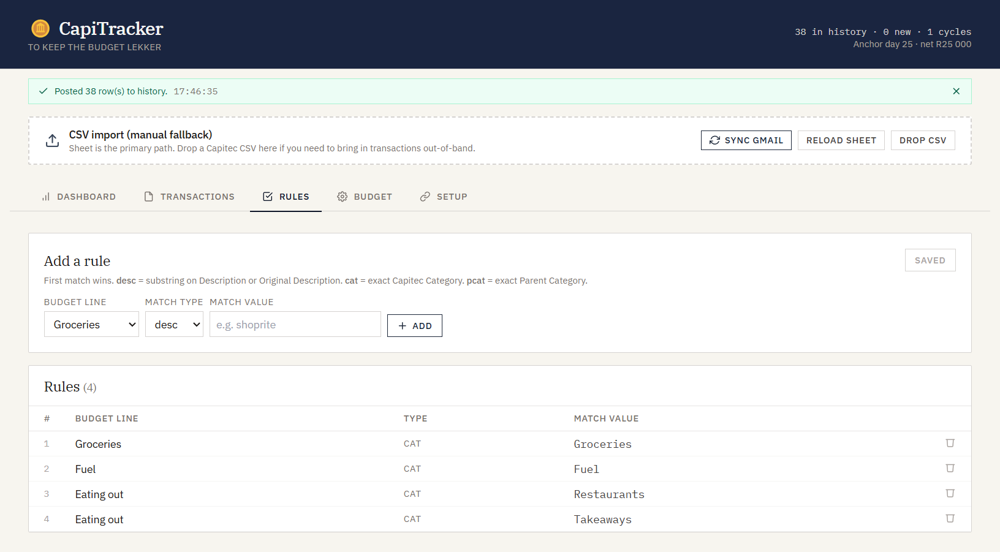

# CapiTracker

> To Keep the Budget Lekker.

🪙 **Try it live:** **https://milandekock.github.io/capitracker/**



A single-file budget tracker for South African bank statements. Reads CSVs you email to yourself, classifies them with simple rules, and shows you how the current pay cycle is tracking against your budget.

**Built specifically for Capitec CSVs** (main account + credit card). The rule-matching logic is generic, but the CSV ingest assumes Capitec's exact column layout (`Money In` / `Money Out` / `Fee` split, plus an auto-populated `Category` column). Other SA banks (FNB, Standard Bank, Nedbank, ABSA) use different column names and don't auto-categorise — adapting to them is a real porting job, not drop-in. PRs welcome.

## Why

Most budget apps either cost money or their bank integrations don't work in South Africa (aiii Vault22). This tool bridges most of the gap — you still have to manually email your statement CSV to yourself (use the same Gmail address the Google Sheet is saved under), but the script picks it up automatically from there. Beats manually exporting and importing every month.

It's also **pay-cycle aware**: if you get paid on the 25th, calendar months split your spending in half and the budget-vs-actuals comparison gets skewed. CapiTracker lets you pick the cycle window (default 25th → 25th) so what you see matches how you actually spend.

## How it works

```
Bank emails CSV → Apps Script ingests → Google Sheet (canonical store)
                                              ↓
                                  budget_tracker.html (view + edit)
                                              ↓
                              classified rows posted back to Sheet
```

- **Apps Script** auto-pulls `account_statement_*.csv` attachments from Gmail (last 30 days) into a `Bank Statement` tab.
- **Single-file HTML app** (React via Babel-standalone, no build step) reads from the Sheet, lets you classify unreviewed rows, and posts confirmed classifications back to a `Transactions` tab.
- **Budget, rules, and settings** are persisted to their own tabs in the same Sheet — your phone, laptop, and browser all see the same data.

## Setup (~10 min)

### 1. Create the Google Sheet + Apps Script

1. Create a new Google Sheet. Name it whatever you like.
2. Extensions → Apps Script. Delete the placeholder `Code.gs`.
3. Paste the contents of [`apps_script.gs`](apps_script.gs) into the editor.
4. Change `SHARED_TOKEN` at the top to a long random string (~32 chars; any password generator works).
5. Save (Ctrl+S).
6. Click **Deploy → New deployment → ⚙️ gear → Web app**.
   - Execute as: **Me**
   - Who has access: **Anyone with the link**
7. Click **Deploy**. Authorize when prompted. On "Google hasn't verified this app", click **Advanced → Go to project (unsafe) → Allow** — this is normal for your own personal scripts.
8. Copy the **Web App URL**.

### 2. Hook up the HTML app

1. Open [`budget_tracker.html`](budget_tracker.html) in your browser (just double-click — no server needed).
2. Go to the **Setup** tab.
3. Paste the **Web App URL** and the **SHARED_TOKEN** you set in step 1.4.
4. Reload. Your tabs should now load from the Sheet.

### 3. Send your bank CSVs to your Gmail

Send `account_statement_*.csv` attachments to the **same Gmail address** that owns the Apps Script. The script searches its own inbox using `from:me`, so the email must come *from* that address (sent to itself is fine — it's still "from me").

> **Gotcha:** if you have multiple Gmail accounts and forward the CSV from a different one (e.g. work → personal), the script won't find it. Either send from the same account, or edit `GMAIL_QUERY` in your `apps_script.gs` to use `to:me` instead.

The Apps Script picks new attachments up on Sheet open, or whenever the app calls "Sync Gmail".

## Features

- **Sheet-backed** — all data lives in your Google Sheet, not in browser storage.
- **Pay-cycle aware** — budget windows align with your pay day, not the calendar month.



- **Running watch** — pick any budget line, see a live running total of spend against it for the current cycle, with red rows once you've gone over.



- **Rule-based classification** — match by description substring, exact category, or parent category. First match wins.





- **Bulk-edit transactions** — multi-select rows on the Transactions tab and apply a budget line to all of them in one click, or delete a batch from history. For when a single rule mis-tagged twenty rows and you don't want to fix them one at a time.
- **Dedup on import** — re-imports the same CSV without creating duplicate rows.
- **Multi-account merge** — all your Capitec accounts (main, credit card, savings, etc.) feed into one ledger, with each row tagged by account.
- **Private mode** — blur amounts with one click for screen-sharing.
- **No build step** — single HTML file, React via Babel-standalone, Tailwind via CDN.

## Tech

- Frontend: React 18 (UMD) + Babel-standalone + Tailwind CDN + PapaParse, all loaded from CDNs at runtime.
- Backend: Google Apps Script as a Web App, exposing `doGet` / `doPost` over the Sheet.
- Persistence: Google Sheet (canonical) + browser `localStorage` (Web App URL, token, UI state).

## File layout

```
budget_tracker.html   Main app (open this in a browser)
apps_script.gs        Paste into Apps Script editor inside the Sheet
setup_wizard.html     Optional first-run setup helper
keys.txt              YOUR token + Web App URL (gitignored, do not commit)
```

## Security model

CapiTracker runs entirely in your own infrastructure: your Google account, your Sheet, your browser. There's no central server, no shared database, and the maintainer never sees your data. But since this tool touches financial data, the trust model is worth understanding.

### What protects your data

- Your **Google account** (with 2FA, hopefully) owns the Sheet that holds your transactions.
- A **single `SHARED_TOKEN`** you choose at setup gates every request from the HTML app to your Apps Script. Wrong token → rejected.
- The token and Web App URL live in your **browser's localStorage**, scoped to `milandekock.github.io`. They don't leave your browser except to hit your own Apps Script.

### Worst case if your token leaks

Someone with your **`SHARED_TOKEN` + Web App URL** can:
- Read every transaction, your budget, your rules, your settings.
- Trigger the Gmail scan and read any matched bank-statement CSVs.
- Overwrite or delete data in your Sheet. *Recoverable via Sheets version history.*

They **cannot:**
- Touch your bank account or move money — there's zero banking API access.
- Read any other Gmail beyond the hardcoded bank-statement query.
- Access any other Google service (Drive, Docs, Calendar, other Sheets).
- Send email from your address.
- Take over your Google account or see your password / 2FA.

**TL;DR — privacy loss is real, financial loss is zero.**

### Recovery (~5 min if it ever happens)

1. Apps Script → Deploy → Manage deployments → **archive** the current one.
2. Set a new `SHARED_TOKEN`. Create a new deployment (new URL).
3. Update your HTML's Setup tab with the new URL + token.
4. Sheet → File → Version history → restore anything that was tampered with.

### Defensive defaults

- Use a long random `SHARED_TOKEN` (32+ chars from a password generator). Don't commit it.
- Turn on **2FA on your Google account** if you haven't.
- Treat the Web App URL as semi-sensitive. It must be "Anyone with the link" for the architecture to work, but it shouldn't be on your public Twitter either.

### Residual risks

- **CDN supply chain.** The HTML loads React, ReactDOM, Babel, and PapaParse from public CDNs. Exact versions are pinned with **Subresource Integrity (SRI)** hashes — if a CDN swaps the file, your browser refuses to execute it. Tailwind's Play CDN serves dynamic CSS and can't be SRI'd, so that remains a small residual risk.
- **Trust in the maintainer.** GitHub Pages serves whatever's on `main`. A compromised maintainer account could push hostile code. Mitigation: 2FA on the maintainer account. For zero-trust users: fork the repo, audit the code, host your own GitHub Pages.

### Reporting a vulnerability

Please don't open public Issues for security problems. See [SECURITY.md](SECURITY.md).

## Contributing — help make this work for your bank

Right now CapiTracker only really works with Capitec CSVs. If you bank elsewhere and want to use this — **open an issue or a PR**. The kind of contributions that are welcome:

- **Other SA bank parsers** — FNB, Standard Bank, Nedbank, ABSA, Investec, Discovery, TymeBank. The bank-specific bit lives in the CSV ingest inside `apps_script.gs`. Everything else is bank-agnostic.
- **Bug reports** — anything weird, broken, or confusing, drop it in [Issues](https://github.com/MilanDeKock/capitracker/issues).
- **Feature ideas** — pay-cycle visualisations, alerts, mobile polish, export options. Open an issue first so we can chat before you build.

**The vision:** a free, open-source budgeting tool that works for every SA bank's CSV. You set it up yourself — which is half the fun — and the data stays in your own Google Sheet. No subscriptions and accounts.

## License

MIT — see [`LICENSE`](LICENSE).
